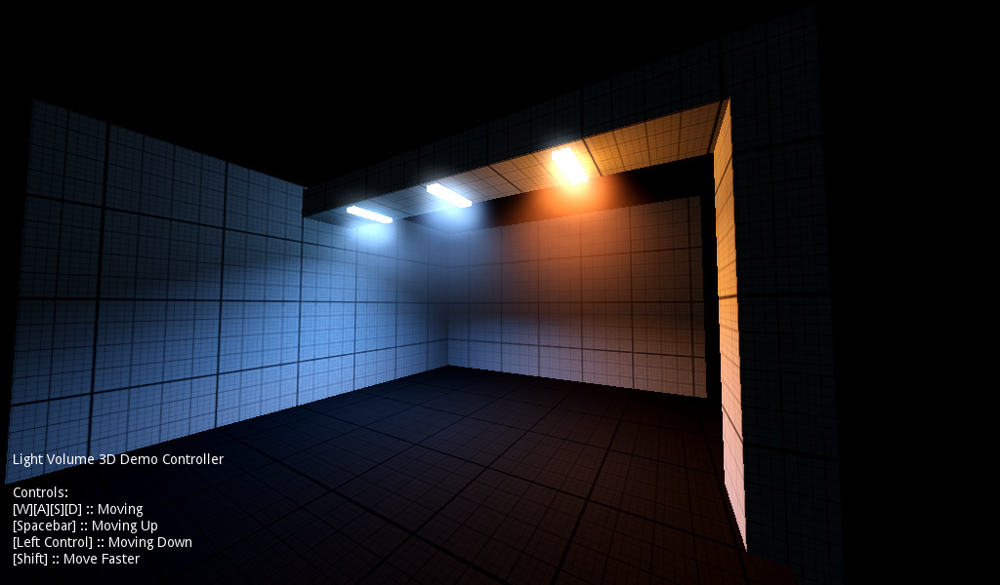
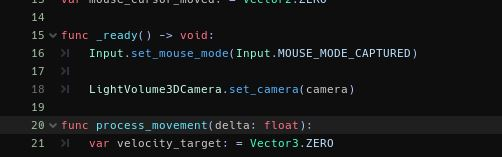
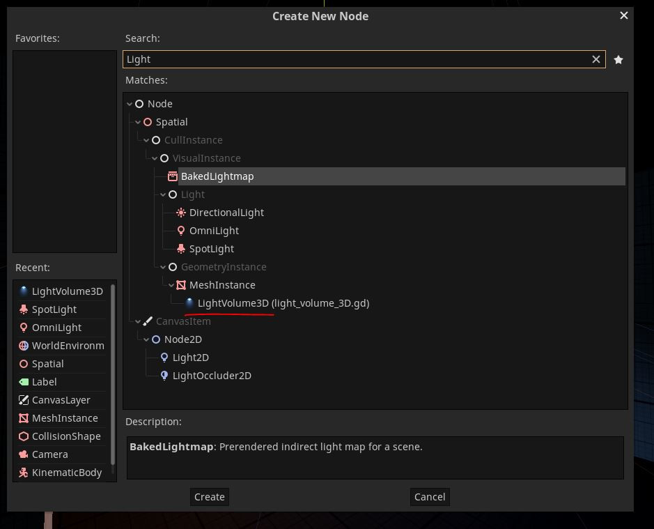
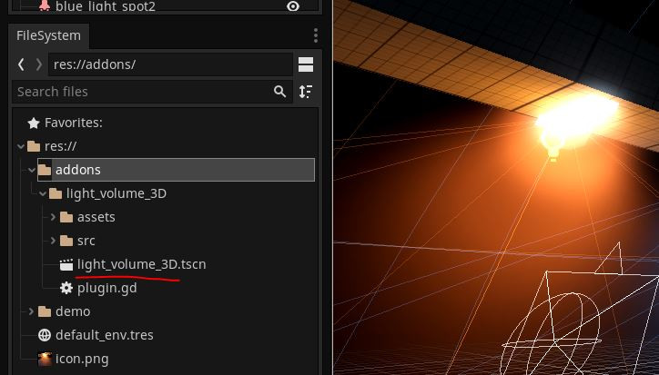
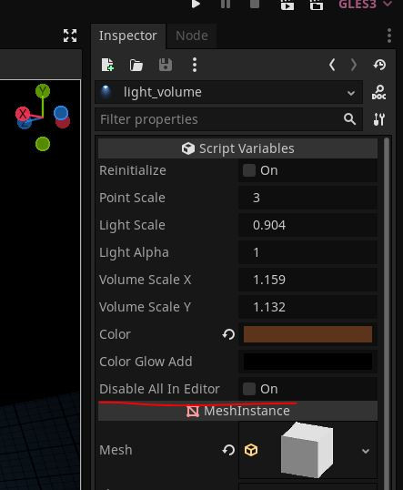

# LightVolume
"Light Volume 3D" node plugin for Godot 3.x/4.x 

	

In [this reddit post](https://www.reddit.com/r/godot/comments/17aztd4/office_aftermath/) certain devs asked to share the light volumetrics used in this scene. Of course, you can use "Volumetric Fog", but that is not case for my Godot 3.x. game project, additionally you may still be interested in using certain "old" techniques to fake this effect to get more intersting/optimized results.

# Installation
1. Put "light_volume_3D" folder into "addons" folder of your project
2. Enable the "LightVolume3D" plugin in your project settings
3. In code of your player controller, add `LightVolume3DCamera.set_camera(camera)` to refer to your camera node.

	

# Usage
You can either create a new node...

	

... or drag a scene right from addons folder

	

# Known issues
Sadly, i couldn't fix an issue with selection of these nodes. I did fix some issues regarding choosing of children, however, these nodes make it much harder to select other nodes in editor. Until i find a more plausible solution, i've added a special boolean variable for you to disable visibility of these nodes when you need to work on the scene.

	

